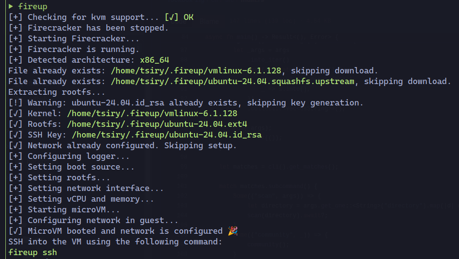

# Fireup

[](https://github.com/tsirysndr/fireup/actions/workflows/ci.yml)

`fireup` is a tool designed to simplify the process of setting up and managing Firecracker microVMs. It automates the preparation of the necessary files, including kernel images, root filesystems, and SSH keys, to quickly get you started with [Firecracker](https://firecracker-microvm.github.io/).



## Features

- **Quick Setup**: Prepares linux kernel, Ubuntu/Debian/Alpine rootfs, and SSH keys in one command.
- **Seamless VM Management**: Start, stop, and monitor Firecracker microVMs with intuitive subcommands.
- **Network Configuration**: Automatically sets up TAP devices, IP forwarding, and NAT for connectivity.
- **SSH Access**: Easily connect to the microVM via SSH.
- **Cross-Architecture Support**: Supports x86_64 and aarch64 with automatic detection.
- **Robust Error Handling**: Clear error messages using anyhow for easy debugging.

## Installation

You can install `fireup` using bash:

```bash
curl -sSL https://raw.githubusercontent.com/tsirysndr/fireup/main/install.sh | bash
```

### Ubuntu/Debian

```
echo "deb [trusted=yes] https://apt.fury.io/tsiry/ /" | sudo tee /etc/apt/sources.list.d/fury.list
sudo apt-get update
sudo apt-get install fireup
```

## Subcommands
- `up`: Starts the Firecracker microVM, preparing assets and configuring the network if needed.
- `down`: Stops the running Firecracker microVM.
- `status`: Checks the status of the Firecracker microVM (running, stopped, or errored).
- `logs`: Displays the logs of the Firecracker microVM from the log file.
- `ssh`: Connects to the Firecracker microVM via SSH.
- `reset`: Resets the Firecracker microVM, stopping it and preparing it for a fresh start.
- `help`: Prints help information for the CLI or specific subcommands.
